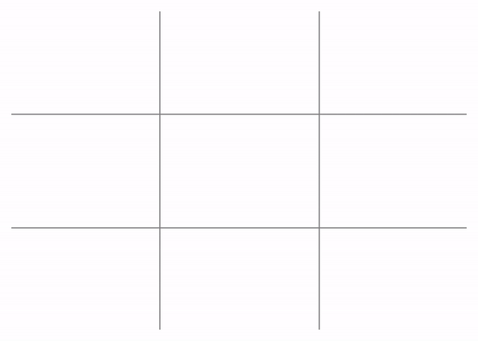

# Tic-tac-toe
## Project is created with Ruby using [Gosu](https://www.libgosu.org/) 2D game development library.

The classic Tic-Tac-Toe game (also called noughts and crosses), for two players, X and O, who take turns marking the spaces in a 3x3 grid.



## Setup
To run this project install [Gosu](https://www.libgosu.org/) and [Hasu](https://github.com/michaelfairley/hasu)
```
gem install gosu
gem install hasu
```
After it's installed, just run:
```
ruby game.rb
```
## How to play

Two human players can play against each other, using mouse and selecting a square. In order to win the game, a player must place three of their marks in a horizontal, vertical, or diagonal row. 

## Inspiration :rocket:

My big interest in board games and a fun to solve problems. Also I wanted to learn how to work with library and classes, and was inspired by an implementation of this game by Ben Scheirman (https://github.com/subdigital/tic-tac-toe.)
